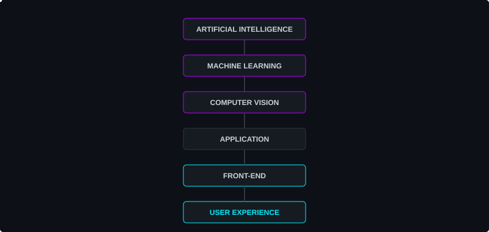
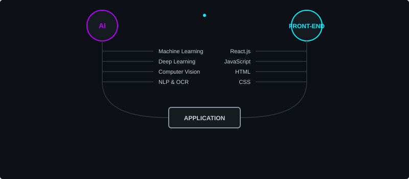
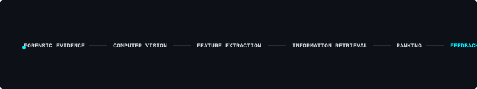

  

  <h1>THUGU GANESH KUMAR REDDY</h1>
  <h3>AI & FRONT-END DEVELOPER</h3>
  
Artificial Intelligence • Machine Learning • Computer Vision • Front-End Development

  
  

    
  

 

  <a href="#about"><code>ABOUT</code></a> &nbsp;
  <a href="#skills"><code>SKILLS</code></a> &nbsp;
  <a href="#experience"><code>EXPERIENCE</code></a> &nbsp;
  <a href="#projects"><code>PROJECTS</code></a> &nbsp;
  <a href="#research"><code>RESEARCH</code></a> &nbsp;
  <a href="#education"><code>EDUCATION</code></a> &nbsp;
  <a href="#connect"><code>CONNECT</code></a>

<h2 id="about">ABOUT</h2>

I am a B.Tech CSE(AI) student working on Artificial Intelligence, Machine Learning, and Computer Vision. I build front-end applications and interactive web experiences, bridging the gap between intelligent data models and practical user interfaces. I am continuously learning, building projects, and transforming AI capabilities into accessible web experiences.

 

  

<h2 id="skills">SKILLS</h2>

  

<code>View All Technical Skills</code>

 

* **AI / Machine Learning:** Machine Learning, Deep Learning, Computer Vision, NLP, OCR, Explainable AI
* **Programming:** Python, Java, C, SQL, JavaScript
* **Front-End:** React.js, HTML, CSS, JavaScript
* **Libraries / Frameworks:** TensorFlow, Keras, Scikit-learn, Pandas, NumPy, OpenCV, Flask, FastAPI, Django, Node.js
* **Databases:** MySQL, MongoDB, SQLite
* **Tools:** Git, GitHub, VS Code, Google Colab, MySQL Workbench

<h2 id="experience">EXPERIENCE</h2>

**AI Research Intern — Vision Technology Lab, IIT Tirupati**  
*May 2026 – July 2026*  
**Project:** ShreeAkshara-OCR — Indic Script Style Adaptation and Augmentation

**Contributions:**
* Synthetic dataset generation
* Style generation
* Document augmentation
* Document degradation
* Image processing
* OCR dataset preparation
* Computer vision research support

 

  

<h2 id="projects">PROJECTS</h2>

<table width="100%">
  <tr>
    <td width="50%" valign="top">
      <h3>01 — MULTI-HORIZON POWER CONSUMPTION FORECASTING</h3>
      
      
<i>Python • TensorFlow/Keras • LSTM • Streamlit • Pandas • NumPy • Scikit-learn</i>

      

        
View details

        
Forecasts Next Hour, Day, Week, and Month for PJM Hourly Energy Consumption dataset utilizing preprocessing, feature engineering, sequence generation, normalization, LSTM forecasting, evaluation (MAE, RMSE, MSE, R²), and visualization.

      

       
      <a href="https://github.com/ganeshkumar0910/Multi-Horizon-Power-Consumption-Forecasting-using-Deep-Learning"><code>[ VIEW CODE ]</code></a>
    </td>
    <td width="50%" valign="top">
      <h3>02 — SMART PARKING SLOT FINDER</h3>
      
      
<i>Python • Flask • SQLite • HTML • CSS • JavaScript</i>

      

        
View details

        
Parking discovery, slot reservation, authentication, booking history, payment management, admin dashboard, and parking slot management.

      

       
      <a href="https://github.com/ganeshkumar0910/Smart-Parking-Slot-Finder"><code>[ VIEW CODE ]</code></a>
    </td>
  </tr>
  <tr>
    <td width="50%" valign="top">
      <h3>03 — SHREEAKSHARA-OCR</h3>
      
      
<i>Python • OpenCV • Diffusion Models • DocCreator • Computer Vision</i>

      

        
View details

        
Focused on Devanagari and Sharada Indic scripts via synthetic data generation, style adaptation, document degradation, and OCR dataset augmentation.

      

    </td>
    <td width="50%" valign="top">
      <h3>04 — AGRISAHAYAK</h3>
      
      
<i>Node.js • JavaScript • Telegram Bot API • Groq API • OpenWeather API</i>

      

        
View details

        
AI-powered multilingual Telegram farming assistant supporting English, Telugu, Hindi, Tamil, Kannada, and Malayalam. Provides crop guidance, fertilizer guidance, pest guidance, and GPS-based weather information.

      

       
      <a href="https://github.com/ganeshkumar0910/AgriSahayak"><code>[ VIEW CODE ]</code></a>
    </td>
  </tr>
  <tr>
    <td width="50%" valign="top">
      <h3>05 — FRAUD DETECTION SYSTEM</h3>
      
      
<i>Python • Machine Learning • Scikit-learn • XGBoost • SMOTE</i>

      

        
View details

        
Evaluates risk classification models including Logistic Regression, Random Forest, XGBoost, SVM, KNN, and Soft Voting Ensemble with metrics like Precision, Recall, F1-score, ROC-AUC, and Confusion Matrix.

      

    </td>
    <td width="50%"></td>
  </tr>
</table>

<h2 id="research">RESEARCH INTERESTS</h2>

* Retrieval-Augmented Generation
* Computer Vision
* Reinforcement Learning
* Deep Q-Networks
* Information Retrieval
* Multimodal AI
* Document Intelligence

### Current Research Direction: Forensic Evidence Retrieval

  

 
<i>Note: This is a current research interest/exploration.</i>

## GITHUB ANALYTICS

  
  

<h2 id="education">EDUCATION</h2>

**Madanapalle Institute of Technology & Science**  
B.Tech — Computer Science and Engineering (Artificial Intelligence)  
*2023–2027*

<h2 id="connect">CONNECT</h2>

  
  

 

  

