<!-- AI DEVELOPER COMMAND CENTER -->

  

 

  

 

  <a href="#about-system-identity"><code>[ ABOUT ]</code></a>
  <a href="#skills-svg-technology-matrix"><code>[ SKILLS ]</code></a>
  <a href="#experience"><code>[ EXPERIENCE ]</code></a>
  <a href="#project-command-center"><code>[ PROJECTS ]</code></a>
  <a href="#research--exploration"><code>[ RESEARCH ]</code></a>
  <a href="#github-analytics-command-center"><code>[ ANALYTICS ]</code></a>
  <a href="#education"><code>[ EDUCATION ]</code></a>
  <a href="#connect"><code>[ CONNECT ]</code></a>

## ABOUT: SYSTEM IDENTITY

**AI & Front-End Developer**

  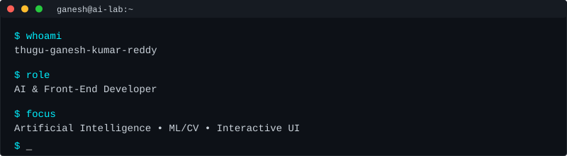

I work at the intersection of complex data modeling and accessible user interfaces. The true value of AI is unlocked when it is seamlessly accessible to the user.

### ⚡ Intelligence Meets Interface

  

## SKILLS: SVG TECHNOLOGY MATRIX

### AI SKILL MAP

  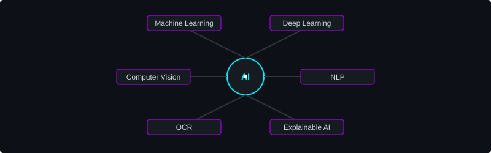

<code>View Full Technology Arsenal</code>

 

* **AI / ML**: Machine Learning • Deep Learning • Computer Vision • NLP • OCR • Explainable AI
* **Programming**: Python • Java • C • SQL • JavaScript
* **Front-End**: React.js • HTML • CSS • JavaScript
* **AI / Data Libraries**: TensorFlow • Keras • Scikit-learn • Pandas • NumPy • OpenCV
* **Backend / Supporting**: Flask • FastAPI • Django • Node.js
* **Databases**: MySQL • MongoDB • SQLite
* **Tools**: Git • GitHub • VS Code • Google Colab • MySQL Workbench

 

### FRONT-END INTERFACE LAB

  

## EXPERIENCE

  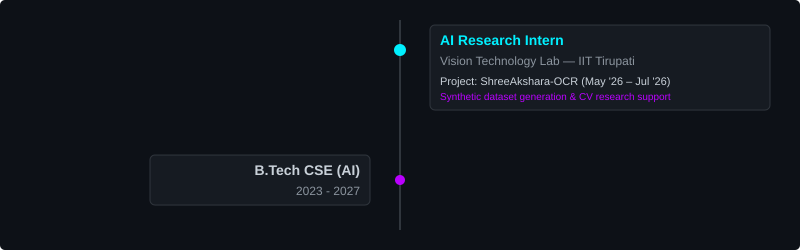

## PROJECT COMMAND CENTER

<table width="100%">
  <tr>
    <td width="50%" align="center">
      <a href="https://github.com/ganeshkumar0910/Multi-Horizon-Power-Consumption-Forecasting-using-Deep-Learning">
        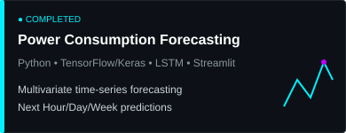
      </a>
    </td>
    <td width="50%" align="center">
      <a href="https://github.com/ganeshkumar0910/Smart-Parking-Slot-Finder">
        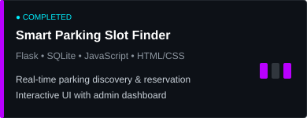
      </a>
    </td>
  </tr>
  <tr>
    <td width="50%" align="center">
      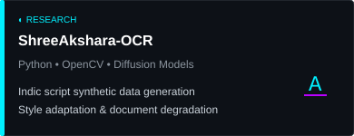
    </td>
    <td width="50%" align="center">
      <a href="https://github.com/ganeshkumar0910/AgriSahayak">
        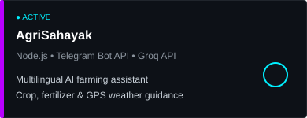
      </a>
    </td>
  </tr>
  <tr>
    <td width="50%" align="center">
      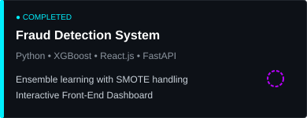
    </td>
    <td width="50%"></td>
  </tr>
</table>

## RESEARCH & EXPLORATION

**Current Exploration Areas:**
`[ RAG ]` `[ COMPUTER VISION ]` `[ REINFORCEMENT LEARNING ]` `[ DQN ]` `[ INFORMATION RETRIEVAL ]` `[ MULTIMODAL AI ]`

### Current Research Direction: FORENSIC EVIDENCE RETRIEVAL

  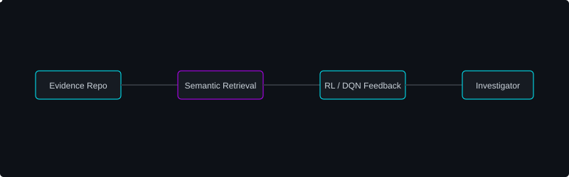

## GITHUB ANALYTICS COMMAND CENTER

  
  

 

  

## EDUCATION

**Madanapalle Institute of Technology & Science**  
B.Tech — Computer Science & Engineering (Artificial Intelligence)  
*2023–2027*

## BUILD &rarr; TEST &rarr; IMPROVE

  

## CONNECT

Interested in AI, front-end development, intelligent applications, or collaborative projects?

  
  

 

  

