

  <!-- 🧠 HERO: NEURAL THOUGHT WAVE -->
  

 

<!-- CONTACT & PROFILE TELEMETRY BUS -->

  
  
  
  

 

<!-- 🧬 OVERALL BACKGROUND: SELF-BUILDING NEURAL NETWORK -->

  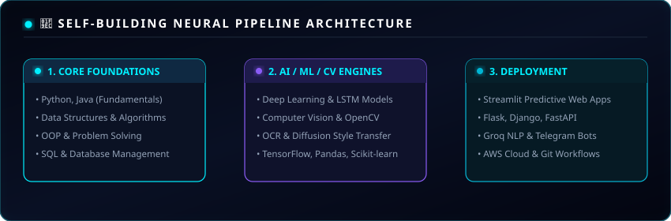

 

<!-- CAREER OBJECTIVE / PROFILE PANEL -->

  

 

<!-- AI LABORATORY STACK -->

  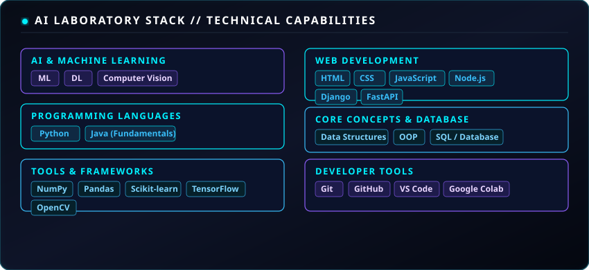

 

<!-- RESEARCH & ENGINEERING EXPERIMENTS (INTERNSHIPS) -->

  

 

<!-- <!-- 🪐 PROJECTS: PROJECT GRAVITY SYSTEM -->

  

  -->

<!-- FEATURED AI & FULLSTACK PROJECTS DETAILED HUD MODULES -->

  <h2><code>// FEATURED RESEARCH &amp; ENGINEERING PROJECT MODULES</code></h2>
  
   

  <a href="https://github.com/ganeshkumar0910/Multi-Horizon-Power-Consumption-Forecasting-using-Deep-Learning">
    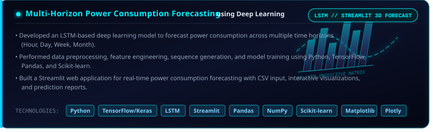
  </a>

    

  <a href="https://github.com/ganeshkumar0910/Smart-Parking-Slot-Finder">
    
  </a>

    

  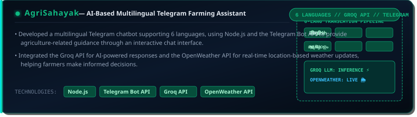

 

<!-- EDUCATION MATRIX -->

  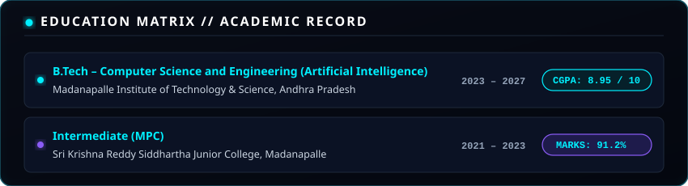

 

<!-- ACHIEVEMENTS & CERTIFICATIONS -->

  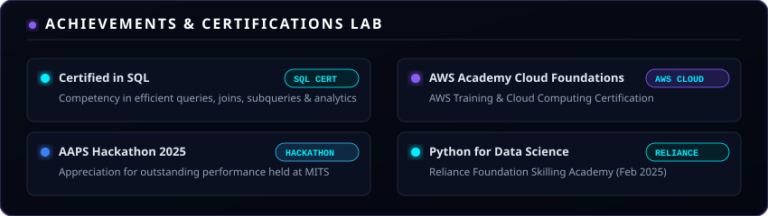

 

<!-- FOOTER CONVERGENCE -->

  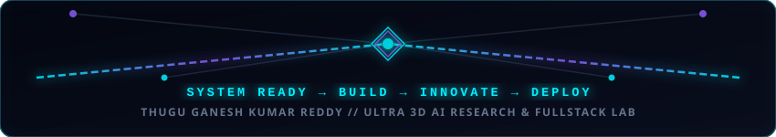

---

### 📄 Comprehensive Resume Content Summary

#### 👤 Contact & Location Information
- **Name:** Thugu Ganesh Kumar Reddy
- **Phone:** +91 9182543364
- **Email:** thuguganeshkumarreddy@gmail.com
- **GitHub:** [ganeshkumar0910](https://github.com/ganeshkumar0910)
- **LinkedIn:** [thugu-ganesh-kumar-reddy](https://linkedin.com/in/thugu-ganesh-kumar-reddy)
- **Location:** Madanapalle, Andhra Pradesh, India
